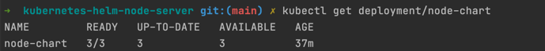

# kubernetes-helm-node-server
Simple node server to handle http requests. Deploying this server on a kubernetes cluster using docker as runtime execution

To create the helm chart :
```helm create node-chart```

To run the cluster up on kubernetes through helm - 
```helm install hello-node-chart node-chart --values node-chart/values.yaml```

If this throws an error, check if kubernetes is running using - 
```kubectl cluster-info```

If this doesn't show an output, check your kubernetes installation. If done through minikube, run the following - 
```minikube start```

To create a simple proxy using port forwarding - 
1. Get any of the many pods of the deployment using - ```kubectl get pods```
2. Use port forwarding like - ```kubectl port-forward <name of the pod> <host-port>:<deployment-port>```

For creating a new release, we can use helm upgrade as a much simpler alternative to the kubectl commands -
```helm upgrade hello-node-chart node-chart --reset-values```

Check the history of the deployment using -
```helm history <release name>```

Check the replication using -


To stop the deployment -
```helm uninstall <release name>```

To add a configmap, create a new yaml file in `templates/` and run the helm upgrade command

To view the configmap in the kubernetes cluster, run - 
```kubectl get configmap```
OR
```kubectl describe configmap/<name of the configmap>```

After deploying a configMap, if you want to check if the env variables were set, login into the pod using - 
```kubectl exec --stdin --tty node-chart-77676fd977-h7kzf  -- /bin/bash```